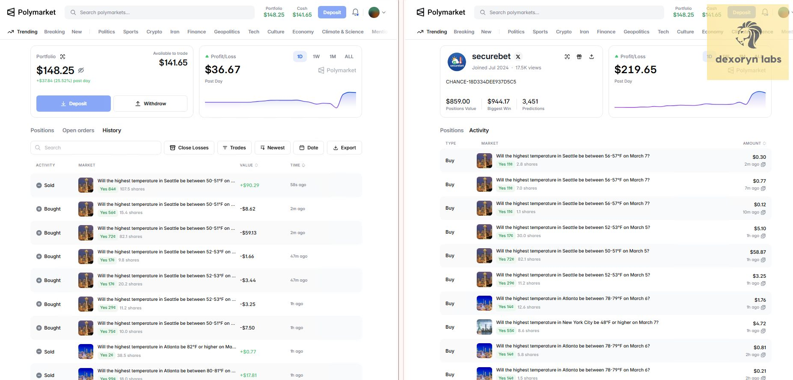

# Polymarket Bot | Торговый бот Polymarket | Бот копи-трейдинга Polymarket

**Языки:** [English](README.md) · [中文](README.zh-CN.md) · [Русский](README.ru.md)

> **Автоматический бот копи-трейдинга Polymarket — зеркалит активных трейдеров в реальном времени**  
> **Проверено в live • Реальное исполнение on-chain • Смена целей в любой момент**

> **Нужна помощь или обновлённая сборка?**  
> 📱 **Telegram**: [t.me/dexoryn](https://t.me/dexoryn) | 🎮 **Discord**: `dexoryn_`

---

## 🎥 Видео с реальной прибылью (архив — Gabagool22)

Эти записи сделаны, пока **@gabagool22** активно торговал. На видео бот выполняет реальные копи-сделки в сети — не симуляцию.

**Кошелёк (историческая цель):** `0x6031b6eed1c97e853c6e0f03ad3ce3529351f96d`

> **Важно:** Gabagool22 больше не надёжная цель для копирования. Видео остаются доказательством работы бота в продакшене; укажите в `USER_ADDRESSES` трейдеров, которые **активны сейчас**. См. [История 3](#story-3--bot-still-running-after-gabagool22-stopped) ниже.

### Видео 1 — Live-копирование

https://github.com/user-attachments/assets/2194ef92-b0f7-40e1-9835-4d2965e85e81

- **+$80 прибыли за ~15 минут**
- Бот работал без присмотра
- Реальное исполнение on-chain, не симуляция

### Видео 2 — Второй запуск (подтверждение)

https://github.com/user-attachments/assets/df3a6791-89b5-4230-ae40-fb7130dcadc4

- **Ещё +$230 за следующие ~15 минут**
- Тот же бот, та же логика, отдельный запуск
- Полностью автоматический копи-трейдинг

---

## 📖 Истории из live (реальное использование)

### История 1 — Сессия без присмотра (эпоха Gabagool22)

После обновления бота я запустил его для проверки новой логики и ушёл играть в бильярд с друзьями — бот продолжал работать.

Примерно через час после возвращения:

- ✅ Бот работал штатно
- ✅ Копирование было точным
- ✅ Сделки совпадали с транзакциями целевого трейдера
- ✅ Уже была зафиксирована прибыль

Это полностью автономный live-запуск, не симуляция и не бэктест.

---

### История 2 — Повторяемый результат (видеозаписи)

Два видео выше — из **разных live-сессий** в разные дни. Один код, один конвейер мониторинга и исполнения — без ручных кликов в Polymarket. Мы оптимизируем **стабильную автоматизацию**, а не разовую удачу.

---

### История 3 — Бот работает после того, как Gabagool22 перестал быть целью

<a id="story-3--bot-still-running-after-gabagool22-stopped"></a>

Gabagool22 со временем **снизил активность и перестал быть практичной целью** — меньше сделок, другая модель или просто неактивность. Многие копи-трейдеры упираются в ту же стену: кошелёк, который работал в прошлом месяце, замолкает, и бот кажется «сломанным», хотя проблема в **отсутствии сигнала**, а не в софте.

Что мы сделали:

- Оставили **тот же бот** — без переписывания и «нового продукта»
- Обновили `USER_ADDRESSES` на **другие активные кошельки Polymarket** (скрипты в `src/scripts/research/` или собственный анализ)
- Проверили весь пайплайн: детекция → размер позиции → ордер → логирование

Что увидели:

- ✅ Процесс стабилен
- ✅ Сделки новой цели детектируются и копируются корректно
- ✅ Логи и история в MongoDB обновляются как ожидается
- ✅ Сбои только в отдельных рыночных/ордерных кейсах, а не «бот умер вместе с Gabagool22»

#### Идеальный результат копи-трейдинга — зеркало **securebet**

После смены цели мы копировали [**securebet**](https://polymarket.com/@securebet) и сделали такой скриншот:

<p align="center">
  
</p>

**Так и должен выглядеть правильный копи-трейдинг.** Слева — ваш кошелёк бота, справа — целевой трейдер: **одинаковая форма графика PnL** за день — тот же флэт, просадка и всплеск восстановления в конце. Суммы в долларах отличаются из-за размера позиции (`COPY_SIZE`, множители и баланс), но **кривая следует за лидером** — сделки детектируются и копируются синхронно, без отставания и без борьбы со стратегией.

В той же сессии в activity/history — те же рынки (например, температурные рынки на скриншоте). Это то, что важно трейдерам: **следуешь за кошельком — получаешь тот же паттерн кривой капитала.**

**Вывод для трейдеров:** бот следует за **любым адресом, который вы зададите**, а не за одним «звёздным» кошельком. Когда трейдер перестаёт подходить — **меняйте адрес, а не бота.** Прошлые результаты с Gabagool22 не гарантируют будущее по любой цели.

---

## ⭐ Почему этот бот

### 🎯 Реальные доказательства, а не слова

У многих ботов Polymarket — только скриншоты. В репозитории — **видео live-исполнения** и истории выше, в том числе работа **после** ухода «звезды» в неактив.

### 🚀 Архитектура и производительность

- **Единая структура `data/`** — логи, кэш и результаты симуляций в одном месте
- **Async-first** — Python `asyncio` для низкой задержки
- **Умное кэширование** — меньше лишних API-запросов

### 💡 Функции, которые реально используют трейдеры

- **Агрегация сделок** — объединение мелких исполнений (gas и минимумы Polymarket)
- **Ступенчатые множители** — размер от объёма сделки лидера (`TIERED_MULTIPLIERS` в `.env.example`)
- **Стратегии копирования** — `PERCENTAGE`, `FIXED` или `ADAPTIVE`
- **Симуляция и аудит** — бэктест до live
- **Несколько трейдеров** — копирование нескольких кошельков
- **Опрос раз в 1 секунду** — настраивается через `FETCH_INTERVAL`

### 📈 Сравнение

| Функция | Этот бот | Типичные альтернативы |
|---------|----------|------------------------|
| **Доказательства live** | ✅ Видео + истории | ❌ Только заявления |
| **Цель стала неактивной** | ✅ Смена `USER_ADDRESSES` | ⚠️ Привязка к одному инфлюенсеру |
| **Агрегация сделок** | ✅ | ❌ |
| **Ступенчатые множители** | ✅ | ❌ Только фикс. множитель |
| **Симуляция / аудит** | ✅ | ❌ |
| **Несколько трейдеров** | ✅ | ⚠️ Ограничено |

---

## 🎯 Кому подходит

**Подходит:**

- Трейдерам с **пассивным следованием** за доверенными кошельками
- Пользователям с **Python 3.10+** и файлом `.env`
- Тем, кто понимает **риски on-chain**, gas и смену лидеров со временем

**Не подходит:**

- Тем, кто ждёт **гарантированную** прибыль или вечный «денежный принтер» без контроля
- Новичкам, которые не смотрят логи и не меняют цели при падении активности

---

## Быстрый старт

### Требования

- **Python 3.10+**
- **MongoDB** — подойдёт бесплатный [MongoDB Atlas](https://www.mongodb.com/cloud/atlas/register)
- **Кошелёк Polygon** — USDC для торговли, POL/MATIC для gas
- **RPC URL** — [Infura](https://infura.io) или [Alchemy](https://www.alchemy.com)

### Установка

```bash
git clone https://github.com/dexorynLabs/polymarket-copy-trading-bot-v2.0.git
cd polymarket-copy-trading-bot-v2.0

pip install -r requirements.txt

python -m src.scripts.setup.setup
python -m src.scripts.setup.system_status
python -m src.main
```

Опционально: `pip install -e .`, затем `polymarket-bot` (см. `pyproject.toml`).

**Помощь:** Telegram [@dexoryn](https://t.me/dexoryn)

---

## Конфигурация

Скопируйте `.env.example` в `.env` и заполните секреты. Мастер установки запишет большинство полей.

### Основные переменные

| Переменная | Описание | Пример |
|------------|----------|--------|
| `USER_ADDRESSES` | Кошельки для копирования (через запятую или JSON) | `'0xABC..., 0xDEF...'` |
| `PROXY_WALLET` | Ваш торговый кошелёк Polygon | `'0x123...'` |
| `PRIVATE_KEY` | Приватный ключ (**без** префикса `0x`) | `'abc...'` |
| `MONGO_URI` | Строка подключения MongoDB | `'mongodb+srv://...'` |
| `RPC_URL` | RPC Polygon | `'https://polygon-mainnet...'` |
| `USDC_CONTRACT_ADDRESS` | USDC в Polygon (дефолт в примере) | `'0x2791...'` |
| `CLOB_HTTP_URL` | API Polymarket CLOB | `'https://clob.polymarket.com'` |
| `COPY_STRATEGY` | `PERCENTAGE`, `FIXED` или `ADAPTIVE` | `PERCENTAGE` |
| `COPY_SIZE` | % или USD в зависимости от стратегии | `10.0` |
| `FETCH_INTERVAL` | Интервал опроса в секундах (по умолчанию `1`) | `1` |
| `PREVIEW_MODE` | `true` = только мониторинг | `false` |
| `TRADE_AGGREGATION_ENABLED` | Пакет мелких сделок (по умолчанию `false`) | `true` |
| `TRADE_AGGREGATION_WINDOW_SECONDS` | Окно ожидания (по умолчанию `300`) | `300` |

`TIERED_MULTIPLIERS`, лимиты безопасности и устаревший `TRADE_MULTIPLIER` — в **`.env.example`**.

### Поиск активных трейдеров

```bash
python -m src.scripts.research.find_best_traders
python -m src.scripts.research.scan_best_traders
```

Перед копированием проверяйте активность кошелька и риски.

---

## Безопасность и риски

⚠️ **Бот совершает реальные сделки реальными средствами.**

- Начинайте с малых сумм; сначала `PREVIEW_MODE=true`
- **Меняйте цели**, когда трейдер затих — Gabagool22 это урок, не постоянная настройка
- Копируйте **несколько** кошельков, не один адрес
- Смотрите логи ежедневно; перед live: `python -m src.scripts.setup.system_status`
- Прошлые результаты (включая видео) **не гарантируют** будущее

1. Отдельный кошелёк с ограниченным балансом  
2. Не коммитьте `.env` и не делитесь `PRIVATE_KEY`  
3. Уметь остановить бота (`Ctrl+C`)  
4. Изучать кошельки перед добавлением в `USER_ADDRESSES`  

---

## FAQ

**Можно ли ещё копировать Gabagool22?**  
Любой адрес можно указать, но Gabagool22 **не рекомендуется** — активность упала. Используйте скрипты исследования или свой список **сейчас активных** трейдеров.

**Что если цель перестала торговать?**  
Бот продолжит работать; новых копий не будет, пока в `USER_ADDRESSES` не будет активных кошельков. Это нормально, не поломка бота.

**Работает ли на всех рынках Polymarket?**  
Стандартные рынки — да; экзотика и низкая ликвидность могут давать отдельные сбои с логом/повтором.

**Это open source?**  
Да. Также есть поддерживаемая premium-сборка с доп. поддержкой в Telegram.

---

## Автор и контакты

**Dexoryn Labs** — автоматизация копи-трейдинга Polymarket

- **Telegram**: [@dexoryn](https://t.me/dexoryn) (быстрее всего)
- **Discord**: `dexoryn_`
- **Twitter**: [@dexoryn](https://x.com/dexoryn)
- **GitHub**: [@dexorynLabs](https://github.com/dexorynLabs)
- **WeChat**: отсканируйте, чтобы добавить **DexorynWe**

<p align="center">
  
  &nbsp;&nbsp;
  
</p>

---

## Участие в разработке

1. Fork репозитория  
2. `git checkout -b feature/your-feature`  
3. Commit и push  
4. Откройте Pull Request  

---

## Правовое предупреждение

Торговля на Polymarket сопряжена с **существенным риском убытков**. Dexoryn не несёт ответственности за потери при использовании ПО. Безопасность кошелька, выбор целей и капитал — ваша ответственность.

**Торгуйте только средствами, потерю которых вы можете себе позволить.**

---

Если проект полезен — поставьте ⭐ Star или откройте issue/PR. Вопросы: Telegram [@dexoryn](https://t.me/dexoryn).
